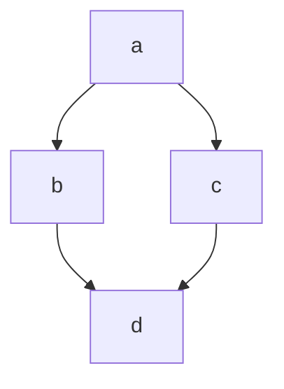

# Hello Word
## Hello Word
### Hello Word
#### Hello Word
##### Hello Word
###### text Normal
 
 
se der espaço
entre linha, então você
terá um novo parágrafo.
 
    Quebra de linha
    com dois espaço
    ao final da linha.<br> é o memos /<br> que você
    entra na HTML
 
**negrito**
_negrito_
==marcado==
sublinhado
~~fiscado~~
*italico*
_italico_
 
 Em um **paragrafo** podendo usar todos os anteriores
 
 ## Lista
 
 1. ordenadas
    1. subitem
 
2. quando você usa um número, o
 
3. proximo item será automaticamente incrementados
    1. subitem
    1. outro
 
-   Não ordenadas
*   Você pode usar um asterisco ou hifen
+   Sinal se mais tambem é aceito
 
- Não ordenadas
- Você pode usar um asterisco ou hifen
- Sinal de mais tambem é aceito
    - subitem
    - subitem
    - subitem
-   o   correto é não misturar os sinais
 
## Link
 
[Clique aqui](https://senac.br/)
[GIT](https://github.com/Beatrizbela/TDS01.git)
 
[ancora](#markdown)
 
Aqui é um parágrafo com link
 [Clique aqui](https://senac.br/ "Titulo para esse link") ou aqui é um parágrafo com um link https://senac.br/
 
 ## Imagens
 

 
 
 
 
 ## Imagem com link                  
 
 []()
 
[](http://gmail.com)
 
## citação
 
> Iniciar minha citação
 
> <br>
> Iniciar minha citação
> <br><br>
 
> Citação
>> sub citação
> ## Titulo dentro de uma citação
 
 
## toggle
 
<details>
    <summary>
    Clique aqui para ver o conteúdo
    </summary>
    Conteúdo  
</details>
 
## separador
 
pode ser 3 traços
 
---
 
ou pode ser 3 asterisco
 
***
 
## checklist
 
- [x] Item 1
- [ ] Item 2
- [ ] Item 3
 
 ## tabela
 
 | nome  | idade |
 | :----:  | :----:  |
 |Beatriz| 17    |
 |gustavolindo| 16    |
 
 | nome  | idade |
 | :----:  | :----:  |
 |Beatriz| 17    |
 |gustavoLindo| 16    |
 
## Código
 
Em linha usamos 1 acento grave para abrir o código e outro para fechar
 
`<h1> Eu sou um título</h1>`
 
<h1> Eu sou um título</h1>
 
` Eu sou um titulo `
 
 # Eu sou um titulo `
 
`console.log('Olá, mundo')`
 
### bloco de código
 
 
Usaremos 3 acentos graves para abrir, seguindo da linguagem que eu quero, e para fechar mais 3 acentos grave.
 
``` html
 
 
<details>
    <summary>
    Clique aqui para ver o conteúdo
    </summary>
    Conteúdo  
</details>
 
```
 
```python
 
print("Olá, mundo")
 
```
 
 
``` css
 
.container{
    display:flex;
}
 
```
 
``` javascript
 
console.log('Olá, mundo!');
 
function dados(dados){
    console.log(dados);
}
 
```
 
## emojis
 
:rocket:
:smirk:
:elephant:
 
:s
:o
:D
 

 
 
 
tem menu de contexto